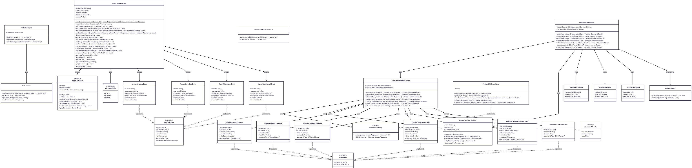
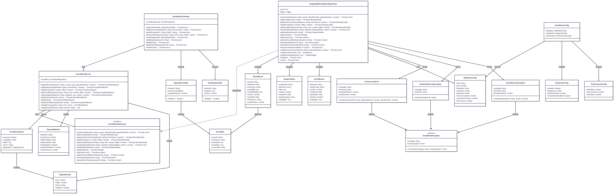
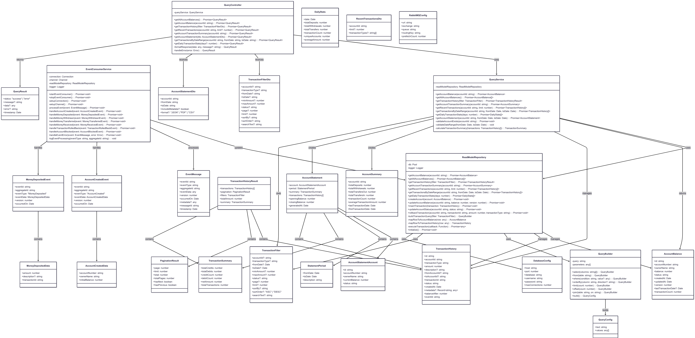

# Event Sourcing System - Code Diagrams Documentation

## 1. Account Command Service - Code Diagram


### **Tổng quan**
Account Command Service là **Command Side** trong kiến trúc CQRS, chịu trách nhiệm xử lý tất cả write operations cho banking system. Service này implement Event Sourcing pattern để đảm bảo audit trail hoàn chỉnh và khả năng replay events.

### **Cấu trúc Layers**

#### **Controllers Layer**
- **`CommandsController`**: REST API controller chính xử lý các banking operations như tạo tài khoản, nạp tiền, rút tiền, chuyển tiền, rollback transaction, và block account. Controller nhận DTOs, convert thành Commands, và gọi `AccountCommandService`.

- **`AuthController`**: Xử lý authentication và authorization với JWT tokens. Cung cấp endpoints cho login, register, và refresh token.

- **`CommandStatusController`**: Theo dõi trạng thái execution của commands, cung cấp command history cho monitoring và debugging.

#### **Application Services Layer**
- **`AccountCommandService`**: Core business service orchestrate toàn bộ command processing flow. Service này:
  - Load `AccountAggregate` từ event store
  - Execute business logic trên aggregate
  - Save uncommitted events
  - Publish events qua `RabbitMQEventPublisher`
  - Return `CommandResult` cho controller

- **`AuthService`**: Handle authentication logic bao gồm user validation, token generation/verification, và JWT management.

#### **Domain Layer**
- **`AggregateRoot`**: Abstract base class implement Event Sourcing pattern với:
  - Event collection (`uncommittedEvents`)
  - Version management cho optimistic concurrency control
  - Event application mechanisms
  - History loading từ persisted events

- **`AccountAggregate`**: Rich domain model chứa toàn bộ business logic cho banking account:
  - **State**: `accountNumber`, `ownerName`, `balance`, `status`, `createdAt`
  - **Behaviors**: `deposit()`, `withdraw()`, `transfer()`, `receiveTransfer()`, `rollbackTransaction()`, `blockAccount()`
  - **Event Handlers**: Apply events để rebuild state từ event history
  - **Business Rules**: Validation logic như sufficient funds, account status checks

- **`AccountStatus`**: Enum định nghĩa các trạng thái account: `ACTIVE`, `BLOCKED`, `CLOSED`

#### **Domain Events**
Event-driven architecture với các domain events:
- **`AccountCreatedEvent`**: Khi tạo account mới
- **`MoneyDepositedEvent`**: Khi nạp tiền
- **`MoneyWithdrawnEvent`**: Khi rút tiền  
- **`MoneyTransferredEvent`**: Khi chuyển tiền ra
- **`MoneyReceivedEvent`**: Khi nhận tiền chuyển vào
- **`TransactionRolledBackEvent`**: Khi rollback transaction
- **`AccountBlockedEvent`**: Khi block account

#### **Commands**
Command Pattern implementation với interface `Command` và các concrete commands:
- **`CreateAccountCommand`**: Tạo account mới
- **`DepositMoneyCommand`**: Nạp tiền
- **`WithdrawMoneyCommand`**: Rút tiền
- **`TransferMoneyCommand`**: Chuyển tiền
- **`RollbackTransactionCommand`**: Rollback transaction
- **`BlockAccountCommand`**: Block account

#### **Infrastructure Layer**
- **`RabbitMQEventPublisher`**: Event publishing infrastructure với:
  - Connection management đến RabbitMQ
  - Exchange và queue setup
  - Batch event publishing
  - Error handling và retry logic

- **`PostgreSQLEventStore`**: Event persistence implementation với:
  - Event storage trong PostgreSQL
  - Optimistic concurrency control
  - Aggregate reconstruction từ events
  - Snapshot support cho performance

- **`JwtAuthGuard`**: Security guard cho API endpoints với JWT validation

### **Design Patterns**
1. **Command Pattern**: Encapsulate requests as command objects
2. **Event Sourcing**: Events as single source of truth
3. **Domain-Driven Design**: Rich domain models với business logic
4. **Repository Pattern**: Abstract data access
5. **CQRS**: Separate command processing
6. **Factory Pattern**: Aggregate creation
7. **Observer Pattern**: Event publishing

### **Data Flow**
```
HTTP Request → Controller → DTO → Command → Service → Aggregate → Events → Repository → EventPublisher → RabbitMQ
```

---

## 2. Event Store Service - Code Diagram

### **Tổng quan**
Event Store Service là specialized service chịu trách nhiệm persist và retrieve events trong Event Sourcing architecture. Service cung cấp optimistic concurrency control, snapshot management, và high-performance event querying.

### **Cấu trúc Components**

#### **Controllers Layer**
- **`EventStoreController`**: RESTful API cung cấp comprehensive event store operations:
  - **`appendEvents()`**: Append events vào stream với concurrency control
  - **`getStreamEvents()`**: Retrieve events từ specific stream
  - **`getAllEvents()`**: Paginated retrieval của all events
  - **`getEventsByType()`**: Query events theo event type
  - **`saveSnapshot()`/`getSnapshot()`**: Snapshot management
  - **`getStreams()`**: List all event streams
  - **`getStreamStatistics()`**: Performance metrics per stream
  - **`healthCheck()`**: Service health monitoring

#### **Application Services Layer**
- **`EventStoreService`**: Business logic layer với comprehensive error handling:
  - Input validation và parameter checking
  - Result formatting với consistent response structure
  - Pagination logic cho large result sets
  - Error transformation và logging
  - Performance optimization với batching

#### **Domain Interface**
- **`EventStoreRepository`**: Interface định nghĩa event store contract:
  - Core operations: save/retrieve events
  - Version management: concurrency control
  - Snapshot operations: performance optimization
  - Stream management: metadata operations
  - Statistics: monitoring và analytics

#### **Infrastructure Implementation**
- **`PostgreSQLEventStoreRepository`**: Production-ready PostgreSQL implementation:
  - **Connection Management**: Connection pooling với proper lifecycle
  - **Transaction Support**: ACID compliance cho event appending
  - **Concurrency Control**: Optimistic locking với version checking
  - **Performance Optimization**: Indexing strategies, query optimization
  - **Error Recovery**: Comprehensive exception handling
  - **Batch Operations**: Efficient bulk operations

#### **Domain Models**
- **`StoredEvent`**: Event representation trong storage:
  - Core event data: `eventId`, `streamId`, `eventType`, `eventData`
  - Metadata: `version`, `createdAt`, `eventPosition`
  - Integrity: `checksum` cho data validation

- **`SnapshotData`**: Aggregate state snapshots:
  - Snapshot metadata: `snapshotId`, `version`, `createdAt`
  - State data: serialized aggregate state
  - Type information: `snapshotType` cho deserialization

- **`EventStream`**: Stream metadata:
  - Stream identification: `streamId`, `streamType`
  - Versioning: current `version`
  - Lifecycle: `createdAt`, `updatedAt`, `isActive`

#### **Exception Handling**
Comprehensive exception hierarchy:
- **`EventStoreException`**: Base exception class
- **`ConcurrencyError`**: Optimistic locking failures
- **`StreamNotFoundException`**: Missing stream handling
- **`InvalidVersionException`**: Version mismatch errors

#### **Configuration Management**
- **`EventStoreConfig`**: Centralized configuration
- **`DatabaseConfig`**: Database connection settings
- **`SnapshotConfig`**: Snapshot strategy configuration
- **`PerformanceConfig`**: Performance tuning parameters

### **Design Patterns**
1. **Repository Pattern**: Clean data access abstraction
2. **Event Store Pattern**: Specialized event persistence
3. **Snapshot Pattern**: Performance optimization
4. **Strategy Pattern**: Configurable behaviors
5. **Template Method**: Error handling workflows
6. **Factory Pattern**: Object creation strategies

### **Data Flow**
```
API Request → Controller → Service → Repository → PostgreSQL
Events ← ← ← ← ←
```

---

## 3. Query Read Service - Code Diagram

### **Tổng quan**
Query Read Service implement **Read Side** của CQRS pattern, chịu trách nhiệm xử lý all read operations và maintain denormalized read models (projections) từ events. Service optimize cho fast queries và complex reporting.

### **Cấu trúc Components**

#### **Controllers Layer**
- **`QueryController`**: Comprehensive read API với rich querying capabilities:
  - **Account Queries**: `getAllAccountBalances()`, `getAccountBalance()`
  - **Transaction Queries**: `getTransactionHistory()`, `getRecentTransactions()`
  - **Reporting**: `getAccountStatement()`, `getTransactionsByDateRange()`
  - **Analytics**: `getDailyTransactionStats()`, `getAccountTransactionSummary()`
  - **Error Handling**: Consistent error responses và validation

#### **Application Services Layer**
- **`QueryService`**: Business logic cho read operations:
  - **Query Processing**: Complex query logic với business rules
  - **Data Aggregation**: Calculate summaries và statistics
  - **Validation**: Input validation và business rule checking
  - **Statement Generation**: Generate comprehensive account statements
  - **Performance Optimization**: Caching strategies và query optimization

- **`EventConsumerService`**: Event-driven projection updates:
  - **Event Processing**: Consume events từ RabbitMQ
  - **Projection Updates**: Maintain read models real-time
  - **Event Handling**: Specific handlers cho từng event type
  - **Error Recovery**: Retry logic và dead letter handling
  - **Performance**: Batch processing và async updates

#### **Infrastructure Layer**
- **`ReadModelRepository`**: Optimized read model storage:
  - **Query Operations**: Complex queries với filtering và sorting
  - **Aggregations**: Pre-calculated summaries và statistics
  - **Performance**: Optimized indexes và query plans
  - **Transactions**: ACID compliance cho consistency
  - **Query Builder**: Dynamic query construction

#### **Read Models (Projections)**
Denormalized models optimized cho specific use cases:

- **`AccountBalance`**: Current account state projection:
  - Core data: `id`, `accountNumber`, `ownerName`, `balance`
  - Status: `status`, `version`
  - Timestamps: `createdAt`, `updatedAt`, `lastTransactionDate`
  - Metrics: `transactionCount`

- **`TransactionHistory`**: Transaction projection với rich metadata:
  - Transaction data: `transactionId`, `amount`, `transactionType`
  - Relationships: `fromAccountId`, `toAccountId`
  - State: `status`, `balanceAfter`
  - Audit: `createdAt`, `eventId`, `metadata`

- **`AccountSummary`**: Aggregated account analytics:
  - Totals: `totalDeposits`, `totalWithdrawals`, `totalTransfersOut/In`
  - Metrics: `transactionCount`, `averageTransactionAmount`
  - Timeline: `firstTransactionDate`, `lastTransactionDate`

- **`AccountStatement`**: Comprehensive statement with nested data:
  - Account info: `AccountStatementAccount`
  - Period: `StatementPeriod`
  - Summary: `TransactionSummary`
  - Transactions: full transaction list
  - Balances: opening/closing balances

#### **Query Infrastructure**
- **`QueryBuilder`**: Dynamic query construction:
  - Fluent interface cho query building
  - Support cho complex filtering
  - Pagination và sorting
  - Parameter binding và SQL injection prevention

- **`TransactionFilter`**: Comprehensive filtering options:
  - Account filtering: `accountId`
  - Type filtering: `transactionType`
  - Date range: `fromDate`, `toDate`
  - Amount range: `minAmount`, `maxAmount`
  - Pagination: `page`, `limit`
  - Sorting: `sortBy`, `sortOrder`

#### **Event Processing**
Event-driven projection updates với specific handlers:
- **`handleAccountCreated()`**: Create new account projection
- **`handleMoneyDeposited()`**: Update balance và add transaction
- **`handleMoneyWithdrawn()`**: Update balance và add transaction
- **`handleMoneyTransferred()`**: Update source account
- **`handleMoneyReceived()`**: Update destination account
- **`handleTransactionRolledBack()`**: Reverse transaction effects
- **`handleAccountBlocked()`**: Update account status

### **Design Patterns**
1. **CQRS**: Separate read model optimization
2. **Event-driven Projections**: Real-time updates từ events
3. **Repository Pattern**: Clean data access
4. **Builder Pattern**: Dynamic query construction
5. **Strategy Pattern**: Multiple query strategies
6. **Observer Pattern**: Event consumption
7. **Materialized View**: Pre-calculated projections

### **Data Flow**
```
Query Request → Controller → Service → Repository → Read Models
Events → EventConsumer → Repository → Read Models (Update)
```

---

## 4. Transaction Processor Service - Code Diagram

### **Tổng quan**
Transaction Processor Service implement **Saga Orchestrator Pattern** để handle complex distributed transactions. Service manage toàn bộ lifecycle của money transfers với compensation logic cho failure scenarios.

### **Cấu trúc Components**

#### **Controllers Layer**
- **`AppController`**: Basic service endpoints:
  - **Health Monitoring**: `getHealth()` với comprehensive health checks
  - **Metrics**: `getMetrics()` cho service performance monitoring
  - **Service Info**: Basic service information

#### **Event Consumers**
- **`TransferEventConsumer`**: Primary event processor:
  - **Message Processing**: Consume `TransferRequested` events từ RabbitMQ
  - **Validation**: Message structure và content validation
  - **Error Handling**: Retry logic với exponential backoff
  - **Dead Letter**: Failed message handling
  - **Monitoring**: Message processing metrics

#### **Application Services Layer**
- **`TransferProcessorService`**: Core transfer processing logic:
  - **Transfer Orchestration**: Coordinate complex transfer workflows
  - **Validation**: Business rule validation cho transfers
  - **Event Publishing**: Publish completion/failure events
  - **Error Handling**: Comprehensive error scenarios
  - **Monitoring**: Transfer processing metrics

- **`SagaOrchestratorService`**: Sophisticated saga management:
  - **Saga Lifecycle**: Start, execute, complete, fail sagas
  - **Step Execution**: Execute individual saga steps
  - **Compensation Logic**: Handle failures với compensation
  - **State Management**: Track saga và step states
  - **Event Publishing**: Saga lifecycle events

#### **Infrastructure Clients**
- **`EventStoreClient`**: HTTP client cho Event Store Service:
  - **Event Operations**: Append/retrieve events
  - **Account Data**: Calculate account balances
  - **Snapshots**: Snapshot operations
  - **Error Handling**: API error handling và retries

- **`SagaDatabaseClient`**: Saga persistence management:
  - **Saga CRUD**: Create, read, update saga instances
  - **Step Management**: Saga step operations
  - **Definitions**: Saga step definitions
  - **History**: Saga execution history
  - **Cleanup**: Cleanup completed sagas

- **`RabbitMQPublisher`**: Event publishing infrastructure:
  - **Event Publishing**: Publish domain events
  - **Batch Operations**: Bulk event publishing
  - **Connection Management**: RabbitMQ connection handling
  - **Error Recovery**: Publishing failure handling

#### **Saga Domain Models**
Rich domain models cho saga management:

- **`SagaInstance`**: Saga execution state:
  - Identity: `saga_id`, `correlation_id`
  - Type: `saga_type` (MONEY_TRANSFER)
  - Status: `status` (STARTED, COMPLETED, FAILED, etc.)
  - Progress: `current_step`, `total_steps`
  - Data: `payload`, `metadata`
  - Lifecycle: timestamps, timeout, retry count

- **`SagaStep`**: Individual step execution:
  - Identity: `step_id`, `step_number`
  - Type: `step_type` (FORWARD, COMPENSATION)
  - Status: `status` (PENDING, EXECUTING, COMPLETED, etc.)
  - Data: `input_data`, `output_data`
  - Error handling: `error_message`, retry logic
  - Events: `event_ids` generated by step

- **`SagaStepDefinition`**: Step templates:
  - Definition: `step_name`, `saga_type`
  - Compensation: `is_compensatable`, `compensation_step_name`
  - Configuration: `timeout_seconds`, `max_retries`
  - Requirements: `required_inputs`

#### **Saga Implementation**
**Money Transfer Saga Steps:**
1. **`VALIDATE_TRANSFER`**: Validate business rules và account states
2. **`WITHDRAW_FROM_SOURCE`**: Debit amount từ source account
3. **`DEPOSIT_TO_TARGET`**: Credit amount đến target account  
4. **`FINALIZE_TRANSFER`**: Mark transfer as completed

**Compensation Steps:**
1. **`COMPENSATE_WITHDRAW`**: Reverse withdrawal (credit back)
2. **`COMPENSATE_DEPOSIT`**: Reverse deposit (debit back)
3. **`REVERSE_FINALIZATION`**: Mark as reversed

#### **Transfer Domain Models**
- **`TransferRequestedEvent`**: Incoming transfer request
- **`TransferResult`**: Transfer processing result
- **`TransferCompletedEvent`**: Successful transfer completion
- **`TransferFailedEvent`**: Transfer failure với error details
- **`AccountBalance`**: Account state for validation

#### **Saga Context & Payloads**
- **`MoneyTransferSagaPayload`**: Transfer request data
- **`SagaStepContext`**: Step execution context
- **`SagaStepResult`**: Step execution result
- **`SagaMetadata`**: Additional saga metadata

#### **Enums & Configuration**
- **Status Enums**: `SagaStatus`, `SagaStepStatus`, `SagaStepType`
- **Step Definitions**: `MoneyTransferSteps`, `CompensationSteps`
- **Types**: `SagaType` cho different saga types

### **Design Patterns**
1. **Saga Pattern**: Distributed transaction management
2. **Orchestrator Pattern**: Centralized workflow control
3. **Compensation Pattern**: Failure recovery
4. **State Machine**: Saga state transitions
5. **Command Pattern**: Step execution
6. **Event Sourcing**: Event-driven saga state
7. **Circuit Breaker**: Failure isolation
8. **Retry Pattern**: Resilience handling

### **Saga Execution Flow**
```
Transfer Request → Consumer → Processor → Saga Orchestrator
                                       ↓
Step 1: Validate → Step 2: Withdraw → Step 3: Deposit → Step 4: Finalize
                                       ↓
                            (On Failure: Compensation)
                                       ↓
Compensate Deposit ← Compensate Withdraw ← Reverse Finalization
```

### **Data Flow**
```
RabbitMQ → Consumer → TransferProcessor → SagaOrchestrator → Database
                                       ↓
EventStore ← ← ← Client ← ← ← Steps ← ← ← SagaOrchestrator
                                       ↓
RabbitMQ ← ← ← Publisher ← ← ← Events ← ← ← SagaOrchestrator
```

---

## Kết luận

Mỗi service được thiết kế theo **Clean Architecture principles** với clear separation of concerns, comprehensive error handling, và production-ready features như monitoring, health checks, và performance optimization. 

### **Key Architecture Highlights:**

1. **Event Sourcing Implementation**: Events là single source of truth
2. **CQRS Separation**: Clear separation giữa Command và Query sides
3. **Domain-Driven Design**: Rich domain models với business logic encapsulation
4. **Saga Pattern**: Distributed transaction management với compensation logic
5. **Event-driven Communication**: Loose coupling via async events qua RabbitMQ
6. **Repository Pattern**: Clean abstraction cho data access
7. **Exception Handling**: Comprehensive error handling và custom exceptions
8. **Configuration Management**: Flexible configuration cho different environments

Tất cả services đều implement best practices cho scalability, reliability, và maintainability trong một production banking system.
